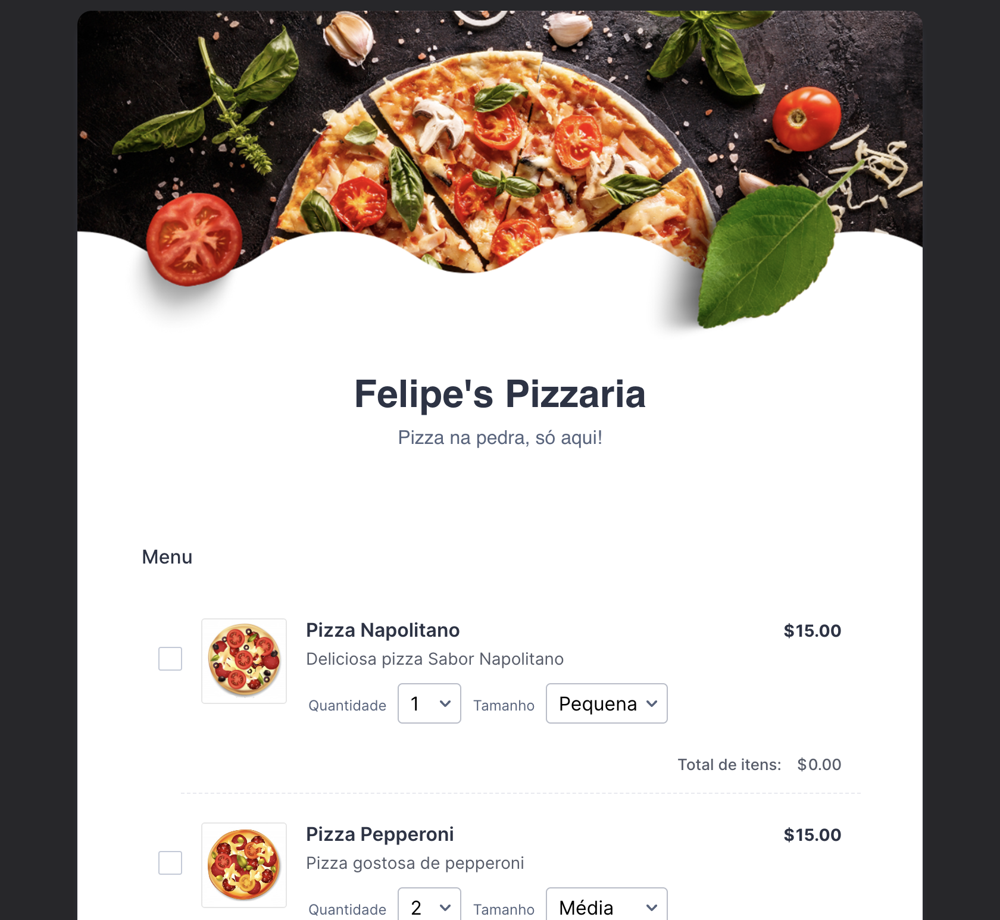
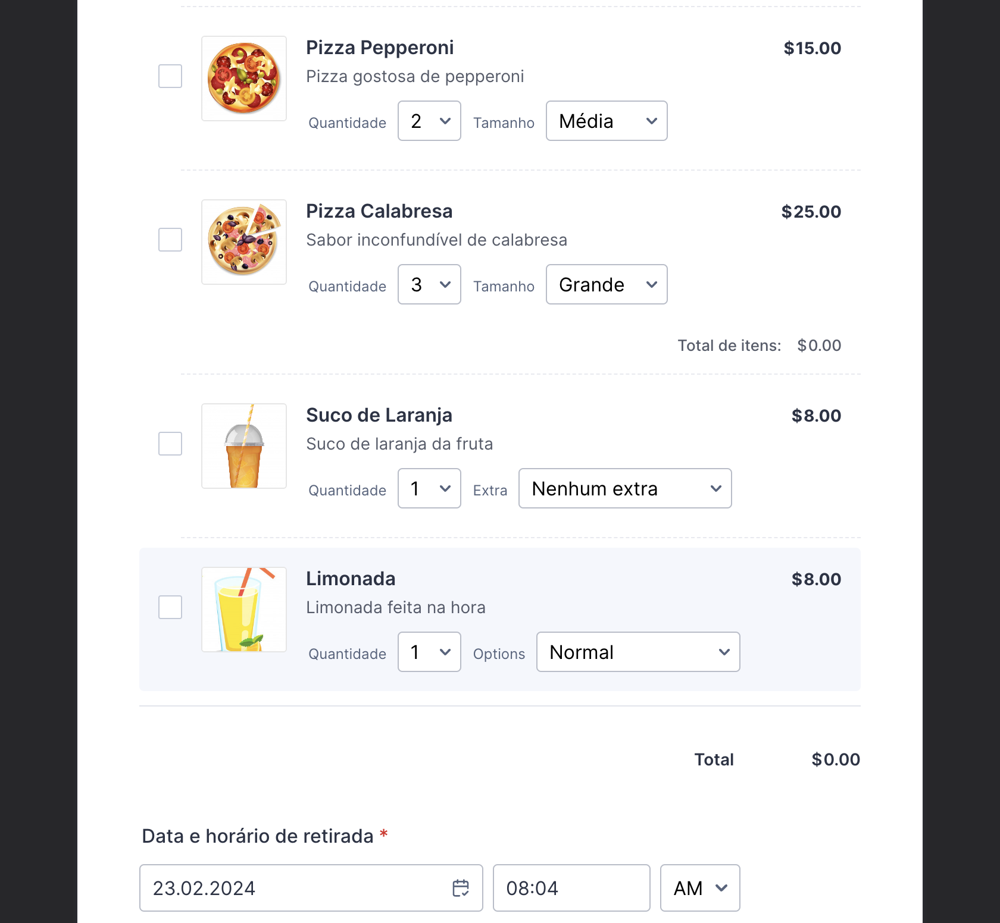
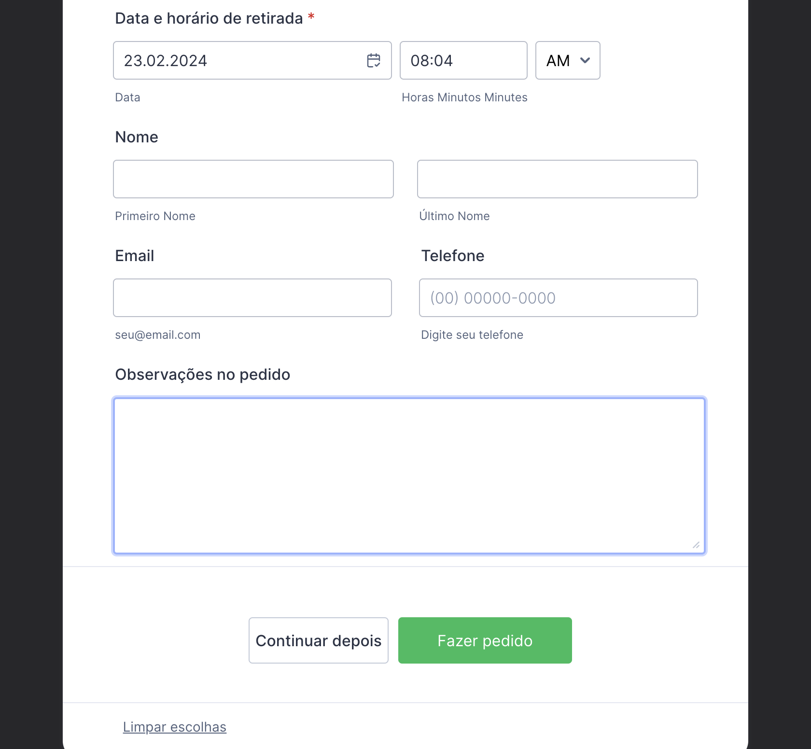

# Teste de Recrutamento para Programadores Front-end

Agradecemos sinceramente o seu interesse em integrar nossa equipe de desenvolvimento. Como parte do nosso processo seletivo, solicitamos que você realize o teste abaixo, projetado para avaliar suas habilidades técnicas e sua capacidade de solucionar problemas.

## Descrição do Teste

Recrie a página tentando chegar ao máximo de semelhança com os exemplos apresentados nos prints de pré-visualização e no vídeo demonstrativo fornecidos (anexos).

## Critérios de Avaliação

Com base na sua implementação, avaliaremos em que nível você se encontra para ingressar em nossa empresa:

- **Nível 1:** Reproduza a página utilizando as tecnologias que você domina.

- **Nível 2:** Reproduza a página e todas as suas funcionalidades utilizando HTML, CSS e JavaScript. Certifique-se de que os botões de ação funcionem corretamente e levem para outra página qualquer.

- **Nível 3:** Reproduza a página utilizando Angular 17, ReactJS ou outra framework front-end atualizada. O botão "Continuar depois" deve salvar os dados preenchidos em localstorage. O botão "Fazer pedido" deve abrir outra página ou rota, ou exibir uma mensagem do tipo Snackbar.

- **Nível 4:** Além dos requisitos do Nível 3, crie uma página de confirmação do pedido seguindo o mesmo layout.

- **Nível 5:** Além dos requisitos do Nível 4, salve a solicitação do pedido em um banco de dados simples em JSON, BJSON ou MySQL. Além disso, envie o pedido via WhatsApp para o número do seu mentor de testes.

## Instruções

Por favor, escreva um código limpo e **não copie códigos de terceiros**. Valorizamos sua capacidade de desenvolver soluções originais.

Ao concluir o teste, faça o upload do seu projeto para o seu repositório no GitHub. No arquivo README do seu repositório, forneça uma explicação detalhada de como você abordou e resolveu o teste. Inclua informações sobre as tecnologias utilizadas, decisões de design, desafios enfrentados e como foram superados, além de quaisquer melhorias ou otimizações implementadas.

Esta documentação é essencial para compreendermos o seu processo de resolução e avaliarmos o seu trabalho de forma adequada.

Se tiver dúvidas durante o teste, não hesite em contatar o seu mentor de testes.

Agradecemos desde já pela sua dedicação e estamos ansiosos para revisar o seu trabalho.

## ANEXOS

### Design
External background color: #2C3345

Fonte Preimária:
color: #2C3345
size: 16px
family: Inter, sans-serif

Fonte secundária:
color: #57647E

Botão: 
color: #FFFFFF
background-color: #18BD5B

### Para se inspirar

Segue abaixo um vídeo da página e alguns prints que podem auxiliar no processo de criação:

https://youtu.be/bp-DHk0pArg?si=ANyaHWKd6PqyvtZ3

